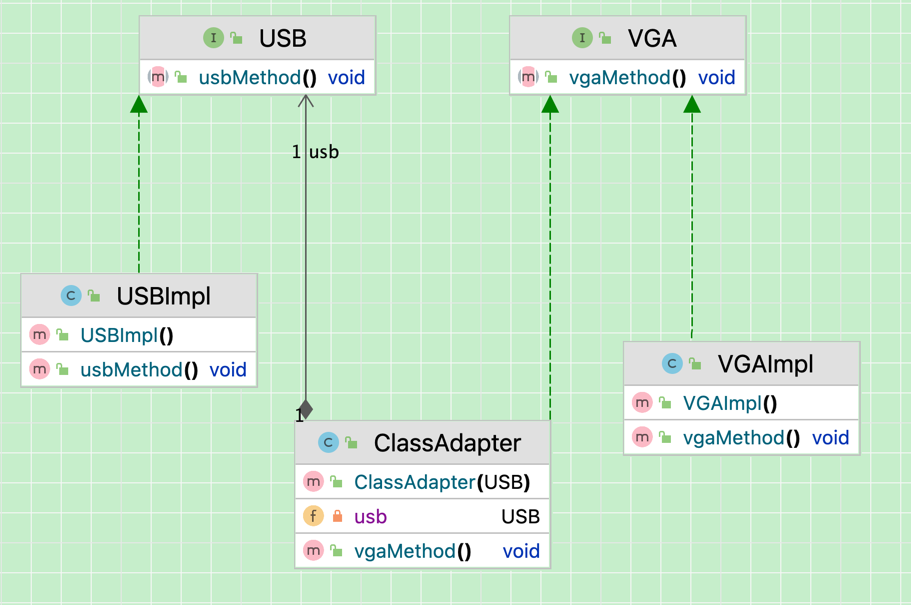
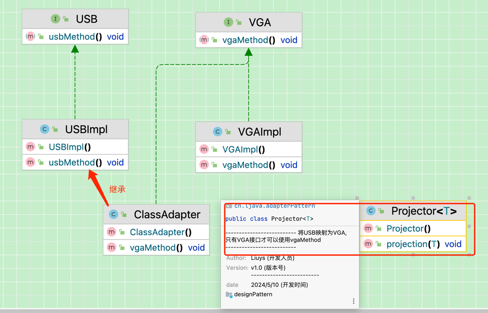
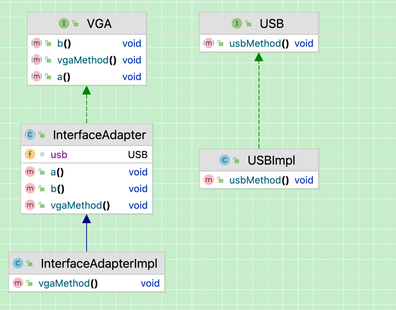

# 结构模式
## 适配器模式
###  对象适配器模式
`VGA`是目标接口，`USBImpl`是被适配者， `ClassAdapter` 是适配器。适配器 `ClassAdapter` 实现了目标接口VGA，并且内部持有一个被适配者对象`USBImpl`，在实现目标接口的方法时，调用了被适配者的特定方法。最后，客户端通过适配器调用目标接口的方法，实际上是调用了被适配者的方法，从而实现了接口之间的适配

### 类适配器模型
通过多重继承目标接口和被适配者类方式来实现适配
举例(将`USB`接口适配到`VGA`接口)

### 接口适配器模式
当不需要全部实现接口提供的方法时,可以采用接口适配器模式,将接口中的方法抽象出来,然后实现需要的方法,其他方法默认实现空方法,那么该抽象类的子类可有选择地覆盖父类的某些方法来实现需求,它适合于一个接口不想使用其所有的方法的情况.

InterfaceAdapter.java抽象实现了`VGA`接口,实现了`VGA`接口中的方法,其他方法默认实现空方法,`InterfaceAdapterImpl`类只需要实现`InterfaceAdapter`抽象类中需要使用的方法即可

## 总结
+ 类适配器模式:通过多重继承目标接口和被适配者类方式来实现适配.当希望将一个类转换成满足另一个新接口的类时,可以使用类的适合器模式,创建一个新类,继承原有的类,实现新的接口即可.
+ 对象适配器模式:当希望将一个对象转换成满足另一个新接口的对象时,可以创建个一个Wrapper类,持有原类的一个实例,在Wrapper类的方法中,调用实例的方法就行.
+ 接口适配器模式: 当不希望实现一个接口中所有的方法时,可以创建一个抽象类Wrapper,实现所有方法,我们写别的类的时候,继承抽象类即可.

使用选择:

根据合成复用原则,组合大于继承.因此,类的适配器模式应该少用.